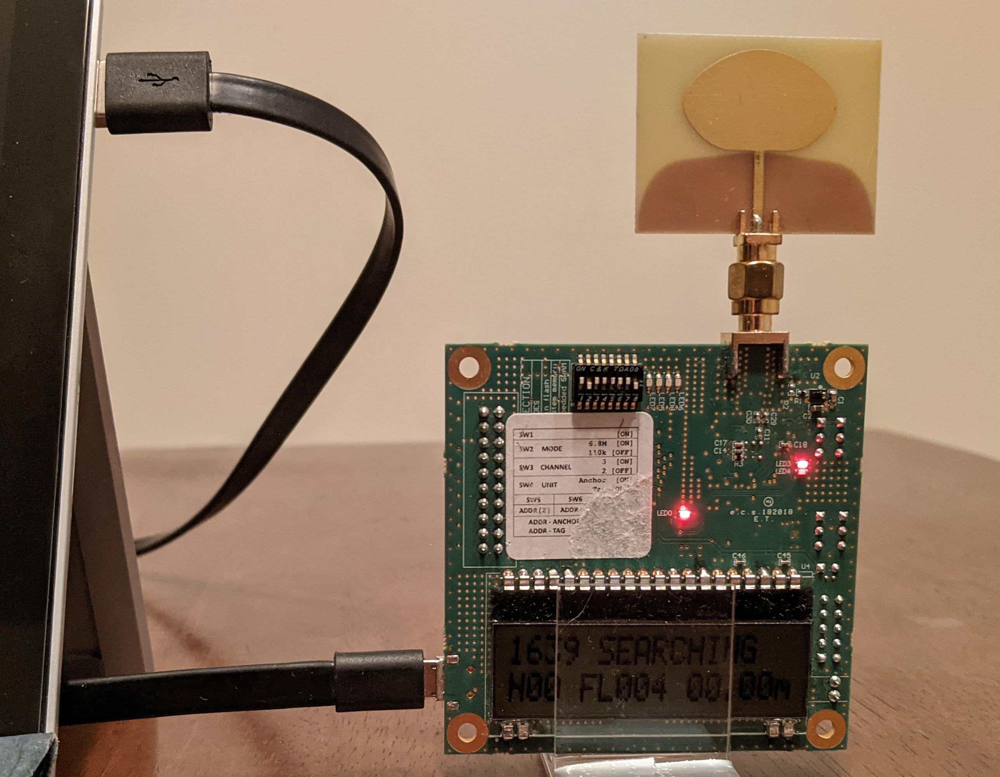

# UWB Interface Package

The UWB Interface package was designed to publish ranging data received from the EVK1000 to a ROS topic. The EVK1000s perform two way ranging with each other and output hexedecimal encoded results for each ranging exchange to their microUSB ports. This node is meant to be run on a separate computer to receive decode, and repackage the data so it can be published to the `/uwb/range` ROS topic. The repackaged data has the following characteristics:

Field | Description | Data Type/Size | Units
--- | --- | --- | ---
timestamp      | Time Stamp                  | (64 bit integer)          | µs
source_address | Source Address              | (16 character hex string) |
anchor_address | Anchor Address              | (16 character hex string) |
tag_address    | Tag Address                 | (16 character hex string) |
range_dist_mm  | Range (distance correctted) | (32 bit integer)          | mm
range_rsl_mm   | Range (RSL correctted)      | (32 bit integer)          | mm
range_raw_mm   | Range (uncorrected)         | (32 bit integer)          | mm
rsl_db         | Received Signal Level (RSL) | (Float)                   | dB

## Setup

### UWB Firmware

This package requires that the EVK1000s be loaded with the firmware found in the [uwb-firmware](https://github.com/Stanford-NavLab/uwb-firmware) repository. It will not work with stock firmware. See the [uwb-firmware](https://github.com/Stanford-NavLab/uwb-firmware) repository for building and loading the correct firmware.

### Physical Connection


Connect a micro USB cable to the UWB and the other end of the UWB cable to the computer that will be running the UWB Interface node.

### Determine Serial Path

After connecting the USB cable, run the following to output the tty devices detected by kernel, in the order that they were detected.

```
dmesg | grep tty
```

Your terminal output should look something similar to the following. Since the UWB was the most recently connected USB device, `/dev/ttyACM0` should be used.

```
[    0.000000] console [tty0] enabled
[    1.241536] tty ttyS20: hash matches
[12078.132129] cdc_acm 1-11.4:1.0: ttyACM0: USB ACM device
```

**_NOTE:_** If you are running the node on WSL (Windows Subsystem for Linux), the address may look something like `/dev/ttyS28`.

## Running

The UWB Interface package can be run with the following:

```
rosrun uwb_interface uwb_interface_node -p /dev/ttyACM0
```

**_NOTE:_** Roscore must be running first.\
**_NOTE:_** The argument after `-p` is the path to the USB port connection and may not be the same as listed above. See the [Setup Section](##Setup) for how to find the correct path.

To test that the node is functioning correctly run the following in another terminal

```
rostopic echo /uwb/range
```

If functioning correctly, messages similar to the following should periodically be printed to the terminal.

```
source_address: "0000000000001639"                          
anchor_address: "0000000000001639"                          
tag_address: "0000000000000CD6"                             
range_dist_mm: 776                                             
range_rsl_mm: 741                                              
range_raw_mm: 553
rsl: -78.2990036011
---
```

## Troubleshooting
If you get the error `Error 13 from open: Permission denied`, then likely the current user
is not part of the dialout group. Add the user to the dialout group with the command below
and then restart the computer.
```
sudo adduser $USER dialout
```
